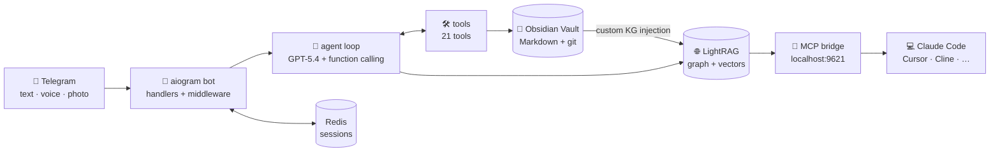
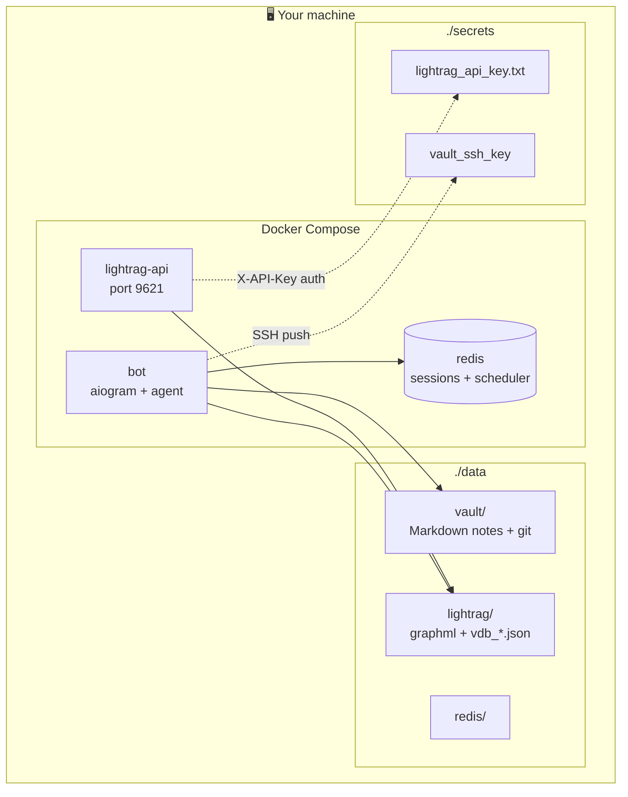

<div align="center">

# 🧠 Mnemo v2.0

### Your second brain. In Telegram. On your own infra.

[](https://www.python.org/)
[](https://docs.docker.com/compose/)
[](LICENSE)
[](https://platform.openai.com)
[](https://obsidian.md)

**🇬🇧 English** · [🇨🇳 中文](docs/README_zh.md) · [🇪🇸 Español](docs/README_es.md) · [🇵🇹 Português](docs/README_pt.md) · [🇫🇷 Français](docs/README_fr.md)

> Translations are kept in step with major releases. For the latest v2.0 changes, this English README is canonical.

</div>

---

## ✨ What is Mnemo?

Mnemo is a **self-hosted AI assistant in Telegram** that turns every conversation you have with it into a **structured knowledge graph** stored as plain Markdown in your own Obsidian vault. Notes are linked, deduplicated, and indexed for semantic + graph search — automatically.

```
🗣️  You: "Had a call with Anna from LegAI today.
         We agreed to ship the Mnemo MVP by June 15.
         She'll handle the architecture."

🤖  Mnemo: ✓ noted.
         Created: Anna (👤 People), LegAI (🏢 Jobs),
                  Ship MVP (✅ Tasks, due 2026-06-15).
         Linked: Anna —[works_at]→ LegAI
                 Anna —[for_project]→ Mnemo
                 Task —[for_project]→ Mnemo
```

It runs entirely on **your own machine** (Docker), syncs to **your own GitHub repo**, and exposes its graph as an **MCP server** so Claude Code, Cursor, Cline, and any MCP-compatible AI coding tool can read your second brain while helping you code.

---

## 🚀 What's new in v2.0

> v2.0 is a quality + cost rewrite of the graph layer. Same UX, much better backend.

| Change | Before (v1) | After (v2) |
| --- | --- | --- |
| 🔥 **Custom KG injection** | LightRAG ran LLM extraction on every note | Typed wikilinks become graph edges directly — **no LLM extraction** |
| 💰 **Cost per note** | ~$0.01–0.02 | ~$0.0001 (embeddings only) — **~100× cheaper** |
| 🎯 **Graph source of truth** | Two graphs (Obsidian + LightRAG) drifted apart | One graph: `frontmatter == LightRAG` |
| 🔗 **MCP bridge** | not exposed | MCP server on `localhost:9621` for Claude Code / Cursor / Cline |
| ✏️ **Rename / delete sync** | orphan entities in graph | hooks delete old entity + reindex new path |
| 🔐 **API auth** | port was open | `X-API-Key` enforced via entrypoint script |
| 🩺 **Healthchecks** | none | Docker `healthcheck:` for all 3 services |

Want the long version? See [`IMPLEMENTATION_PLAN.md`](IMPLEMENTATION_PLAN.md) §G–H.

---

## 🎯 Features

<table>
<tr>
<td width="50%">

### 🧠 Memory
- **Eternal memory** — every Telegram session extracted to typed Obsidian notes (frontmatter + tags + wikilinks)
- **Topic-shift detection** — when you change subjects, the previous session auto-saves
- **Smart linker** — LLM post-pass proposes typed relations (`for_project`, `works_at`, `about_person`, …)
- **Bidirectional links** — `for_project` on a task auto-adds `tasks: [...]` on the project
- **Deduplication** — fuzzy matcher resolves "LegAI" / "ЛегАИ" / "legai" to one entity

</td>
<td width="50%">

### 🌐 Graph & search
- **Custom KG injection** — your typed `[[wikilinks]]` become graph edges, zero LLM extraction
- **Single source of truth** — Obsidian frontmatter == LightRAG graph
- **3072-dim embeddings** — `text-embedding-3-large` for chunks / entities / relationships
- **Hybrid query** — semantic + graph traversal (`local` / `global` / `mix` modes)
- **Maps of Content** — auto-regenerated `MOC_People.md`, `MOC_Projects.md`, …

</td>
</tr>
<tr>
<td>

### 🎙️ Multimodal
- **Text · Voice · Photo** — Whisper-1 transcription, GPT-5.4 Vision
- **Atomic attachment writes** — `tmp + os.replace`, no half-files
- **Custom personality** — name your assistant + 4 communication styles (friendly / direct / sarcastic / mentor)

</td>
<td>

### ⏰ Proactivity & safety
- **APScheduler crons** — morning digest, weekly reflection, stale project nudges
- **Git-backed vault** — every change is a commit, `/undo` reverts the last
- **Single-user whitelist** — middleware-enforced, all other users silently dropped
- **Destructive ops require confirmation** — inline Telegram buttons via Redis pub/sub

</td>
</tr>
</table>

---

## 🏗️ Architecture

### Data flow



### Container topology (Docker Compose)



**Stack:** Python 3.12 · uv · aiogram 3 · OpenAI SDK ≥1.57 · Redis 7 · APScheduler 3 · LightRAG (embedded + HTTP) · rapidfuzz · ripgrep · structlog · pydantic v2 · Docker Compose

---

## ⚡ Quick Start

### 1️⃣ Prerequisites

| You need | Where to get it |
| --- | --- |
| 🐳 Docker + Docker Compose | [docker.com](https://www.docker.com/) |
| 🤖 A Telegram bot token | message [@BotFather](https://t.me/BotFather) → `/newbot` |
| 🔑 An OpenAI API key | [platform.openai.com/api-keys](https://platform.openai.com/api-keys) |
| 🆔 Your own Telegram user ID | message [@userinfobot](https://t.me/userinfobot) |

### 2️⃣ Clone + bootstrap

```bash
git clone https://github.com/komrxn/Khusayinbek_brain.git mnemo
cd mnemo
./setup.sh
```

`setup.sh` is **idempotent** — it creates `secrets/`, `data/{vault,lightrag,redis}/`, generates a fresh `secrets/lightrag_api_key.txt`, and copies `.env.example → .env` if needed.

### 3️⃣ Fill `.env`

Three values are required, the rest have safe defaults:

```env
TELEGRAM_BOT_TOKEN=123456:AA...your_token...
OPENAI_API_KEY=sk-proj-...
ALLOWED_USER_IDS=123456789
TZ=Europe/London          # your timezone — used for daily notes & scheduling
```

> 📦 The full list with comments lives in [`.env.example`](.env.example). Notable extras: `OPENAI_MODEL_MAIN` (default `gpt-5.4`), `SESSION_IDLE_TIMEOUT_MIN` (default `15`), `SENTRY_DSN`.

### 4️⃣ (Optional) Vault git sync

Skip if you don't care about pushing your vault to GitHub.

```bash
ssh-keygen -t ed25519 -C "mnemo-vault" -f secrets/vault_ssh_key -N ""
chmod 600 secrets/vault_ssh_key
# → add secrets/vault_ssh_key.pub as a Deploy key on your private vault repo
#   (Settings → Deploy keys → Add → ☑️ Allow write access)
```

Then in `.env`:

```env
VAULT_GIT_REMOTE=git@github.com:yourname/your-vault.git
```

### 5️⃣ Launch

```bash
docker compose up -d --build
docker compose logs -f bot
```

Wait until you see `Run polling for bot @your_bot id=…` — you're live.

```bash
docker compose ps
# NAME                STATUS                       PORTS
# bot                 Up X minutes (healthy)       —
# lightrag-api        Up X minutes (healthy)       127.0.0.1:9621->9621/tcp
# redis               Up X minutes (healthy)       6379/tcp
```

### 6️⃣ First contact in Telegram

Open your bot in Telegram and send `/start`. The onboarding is multi-step:

1. **Pick a name** for your assistant (`Max`, `Mia`, `Jarvis`, …)
2. **Pick a style** — friendly / direct / sarcastic / mentor
3. **Tell the bot your own name**
4. **Send a free-form portrait** — projects, people, goals, anything. Voice messages work.
5. **Confirm** → vault is initialized, `_meta/owner.md` + `_meta/portrait.md` are committed.

You can now message it anything. Try:

> _"Сегодня встретился с Максом. Обсудили запуск нового продукта в LegAI к 1 июля."_

…and watch a real graph form note-by-note.

### 7️⃣ Connect Obsidian (optional, recommended)

If you set up vault git sync:

```bash
git clone git@github.com:yourname/your-vault.git ~/MyVault
```

Open `~/MyVault` as an [Obsidian](https://obsidian.md) vault. Install the **Obsidian Git** community plugin → set auto-pull every 5 min. Now your vault is a living, browsable graph.

---

## 📁 Vault structure

```
vault/
├── _meta/
│   ├── owner.md             ⭐ you — central anchor of the graph
│   ├── portrait.md          your onboarding portrait (raw)
│   ├── ontology.md          auto-generated entity types
│   ├── scheduled_tasks.md   currently active cron tasks
│   ├── MOC_People.md        🗺️  Map of Content — all people
│   ├── MOC_Projects.md      🗺️  all projects
│   ├── MOC_Jobs.md          🗺️  all jobs
│   └── MOC_Themes.md        🗺️  all themes
├── 00_Inbox/                unprocessed captures
├── 10_Daily/                daily session notes
├── 20_People/               👤 people in your life
├── 30_Jobs/                 🏢 companies, organizations
├── 40_Projects/             🚀 work & personal projects
├── 50_Tasks/                ✅ tasks with deadlines
├── 60_Thoughts/             💭 ideas, observations
├── 70_Memories/             🎞️  personal facts, past events
├── 80_Themes/               🏷️  recurring themes
└── 90_Attachments/          🎧🖼️  voice messages, images
```

Every entity note has YAML frontmatter with **typed link fields** that become graph edges:

```yaml
---
type: task
status: open
due: 2026-06-15
for_project: "[[40_Projects/mnemo]]"   # → graph edge: task -[for_project]-> project
owner: "[[_meta/owner]]"               # → graph edge: task -[owner]-> owner
aliases: ["ship mvp", "launch v1"]     # for fuzzy dedup
---

# Ship Mnemo MVP

- запустить на одном пользователе к 15 июня
- основная фича: голос → vault → граф
```

### Forward relations (= graph edges)

These 8 frontmatter fields become typed edges in the LightRAG graph:

| Field | From → To | Example |
| --- | --- | --- |
| `owner` | any → `_meta/owner` | "this task is mine" |
| `works_at` | person → job | Anna → LegAI |
| `for_job` | task / project → job | task is for LegAI |
| `for_project` | task / thought → project | task is for Mnemo |
| `themes` | project / thought → theme | Mnemo themed AI |
| `about_person` | thought / memory → person | thought about Anna |
| `related_people` | any → person(s) | involves [Anna, Bob] |
| `parent_theme` | theme → theme | "GenAI" → "AI" |

> Inverse fields (`employs`, `tasks`, `projects`, …) are still rendered in the `## Связи` section for Obsidian readability, but they're **denormalized** — the graph only needs forward edges.

---

## 💬 Bot commands

| Command | What it does |
| --- | --- |
| `/start` | Onboarding (first run) or status check |
| `/save` | Force-close current session and extract notes immediately |
| `/undo` | Revert the last vault commit |

Sessions also auto-close after `SESSION_IDLE_TIMEOUT_MIN` minutes of inactivity (default 15).

---

## 🔧 Configuration

All settings go in `.env`. See [`.env.example`](.env.example) for the full list.

| Variable | Required | Default | What |
| --- | :-: | --- | --- |
| `TELEGRAM_BOT_TOKEN` | ✅ | — | Bot token from @BotFather |
| `OPENAI_API_KEY` | ✅ | — | OpenAI API key |
| `ALLOWED_USER_IDS` | ✅ | — | Comma-separated Telegram user IDs |
| `TZ` |  | `UTC` | Timezone (see [tz database](https://en.wikipedia.org/wiki/List_of_tz_database_time_zones)) |
| `OPENAI_MODEL_MAIN` |  | `gpt-5.4` | Main model (chat, extraction, linking) |
| `OPENAI_MODEL_FAST` |  | `gpt-5.4-mini` | Fast model (topic shift, compact tasks) |
| `OPENAI_MODEL_VISION` |  | `gpt-5.4` | Vision model for photo input |
| `OPENAI_EMBED_MODEL` |  | `text-embedding-3-large` | Embedding model (3072 dims) |
| `OPENAI_WHISPER_MODEL` |  | `whisper-1` | Speech-to-text |
| `SESSION_IDLE_TIMEOUT_MIN` |  | `15` | Auto-save session after N min idle |
| `VAULT_GIT_REMOTE` |  | — | SSH URL of your vault repo |
| `SENTRY_DSN` |  | — | Sentry error tracking (optional) |

The `lightrag-api` container also needs `LLM_BINDING`, `EMBEDDING_BINDING`, `EMBEDDING_DIM=3072`, etc. — these are pre-wired in [`docker-compose.yml`](docker-compose.yml) using `${OPENAI_API_KEY}` interpolation. You don't need to touch them unless you switch providers.

---

## 🔌 Connect your brain to AI coding tools (MCP)

Mnemo exposes its knowledge graph as an MCP server on `127.0.0.1:9621`. **Claude Code, Cursor, Cline, Windsurf**, and any MCP-compatible tool can query your second brain while helping you code.

### Step 1. Verify the API is running

```bash
docker compose ps
curl http://localhost:9621/health
# → {"status":"healthy", ...}
```

### Step 2. Install the MCP bridge (on your local machine, not in Docker)

```bash
pip install mnemo-brain-mcp
```

`mnemo-brain-mcp` is our friendly fork of [`desimpkins/daniel-lightrag-mcp`](https://github.com/desimpkins/daniel-lightrag-mcp) — the protocol logic is identical, the package is renamed for a clean PyPI install.

After install the `mnemo-brain-mcp` command is on your `PATH`.

### Step 3. Configure your tool

#### 🤖 Claude Code

Edit `~/.claude/claude_mcp_config.json` (or run `claude mcp add`):

```json
{
  "mcpServers": {
    "mnemo-brain": {
      "command": "mnemo-brain-mcp",
      "env": {
        "LIGHTRAG_BASE_URL": "http://localhost:9621",
        "LIGHTRAG_API_KEY": "<paste contents of secrets/lightrag_api_key.txt>"
      }
    }
  }
}
```

Restart Claude Code. Try: *"What does my brain know about my current projects?"*

#### 🎯 Cursor

`Settings → MCP → Add new MCP server`. Same JSON shape as above.

#### 🌊 Cline / Windsurf

See their docs for the `mcpServers` config location — the JSON shape is identical.

### Step 4. Tools you get

The bridge exposes **20 tools** over MCP. The most useful ones for read-only graph queries:

| Tool | What it does |
| --- | --- |
| `query_text` | 🔍 Hybrid semantic + graph search ("What did I plan for Q3?") |
| `query_text_stream` | streaming variant |
| `get_knowledge_graph` | 🌐 Subgraph around a label (entity relationships) |
| `get_graph_labels` | 🏷️  All entity labels in the graph |
| `check_entity_exists` | quick existence probe |
| `get_documents` | list indexed sources |
| `get_health` | server health |

### 🛡️ Security note

`mnemo-brain-mcp` exposes **22 tools — including write tools** (`insert_text`, `update_entity`, `delete_document`, …). Granting your coding tool access to this MCP server grants it write access to the LightRAG graph.

If you want strict read-only behavior, pick one:

- **Trust your coding tool** — for personal use this is usually fine.
- **Reverse proxy** — put a tiny proxy in front of `9621` that whitelists only `GET /graphs/*`, `POST /query`, `GET /health`.
- **Fork further** — strip the write tools from `mnemo-brain-mcp` (it's MIT and renamed already).

> ⚠️ **Important:** Mnemo's bot is the **only canonical writer to the vault**. Anything an MCP client `insert_text`'s into the graph lives **only in the LightRAG index**, not in your Obsidian Markdown. To write to the vault, message the bot.

### Step 5. Remote access (optional)

Don't expose `9621` to the public internet. Recommended:

- 🛡️ **[Tailscale](https://tailscale.com/)** — `tailscale serve 127.0.0.1:9621` for HTTPS + mesh auth
- 🔒 **SSH tunnel** — `ssh -L 9621:localhost:9621 you@your-server`

---

## 🎨 Recommended Obsidian Graph view

For the cleanest visualization:

- **Filters → search:** `-path:_meta -path:90_Attachments -path:00_Inbox`
- **Display → Existing files only:** ✅ ON
- **Display → Orphans:** ❌ OFF
- **Forces → Repel:** `15`
- **Groups:** color by folder (`20_People` → blue, `40_Projects` → orange, `80_Themes` → green)

The result: your owner node sits in the middle, projects radiate outward, themes cluster, and tasks orbit their projects.

---

## 🛠️ Development

```bash
uv sync                                # install deps
uv run python -m src.main              # run locally (needs Redis on localhost)

uv run ruff check src/ tests/          # lint
uv run ruff format src/ tests/         # format
uv run mypy src/ --strict              # type-check
uv run pytest -q tests/                # 16 tests, ~0.5 s
```

Pre-commit hooks run `ruff` + `mypy` automatically. **Never use `--no-verify`.**

### Project layout

```
src/
├── agent/          loop, extractor, linker, prompts (OpenAI function calling)
├── lightrag_svc/   client, indexer, converter, graph_sync (custom KG)
├── multimodal/     whisper, vision
├── safety/         confirmations
├── scheduler/      apsched, defaults, triggers
├── session/        manager (Redis), keys
├── telegram/       bot, handlers, middleware
├── tools/          21 tools — obsidian, lightrag, scheduler, misc
└── vault/          writer, reader, frontmatter, linking, git_ops, ripgrep
```

Each module has **one responsibility** — see [`CLAUDE.md`](CLAUDE.md) for the full coding contract.

---

## 🔐 Security & privacy

- **Single-user by design** — `ALLOWED_USER_IDS` whitelist enforced in middleware; everyone else silently dropped.
- **Your data is yours** — nothing leaves your Docker host except API calls to OpenAI (and optionally Sentry).
- **No analytics, no telemetry.**
- **API key auth** — `lightrag-api` requires `X-API-Key` for non-whitelisted endpoints.
- **SSH key safety** — vault deploy key is mounted read-only; bot copies it to `/tmp` at runtime with `0600`.
- **Git safeguards** — `--force`, `--no-verify`, `--mirror`, `--hard` are blocked at the code level (assertion).
- **Path-traversal protection** — every vault path is normalized + verified to stay inside `VAULT_PATH`.
- **Destructive actions** require explicit inline Telegram confirmation (e.g. note deletion).

---

## 🧪 Verifying everything works

A quick smoke test to confirm a fresh install is healthy:

```bash
# 1. Containers healthy
docker compose ps   # all 3 should be (healthy)

# 2. Embedded LightRAG works
docker compose logs bot | grep "incremental index done (custom kg)"

# 3. HTTP API works
curl -s http://localhost:9621/health | python3 -m json.tool

# 4. Auth enforced
curl -i http://localhost:9621/graphs?label=mnemo   # → 401 or 403

# 5. Auth lets you in
API_KEY=$(cat secrets/lightrag_api_key.txt)
curl -s -H "X-API-Key: $API_KEY" http://localhost:9621/graph/label/list

# 6. Tests pass
uv run pytest -q tests/
```

A full end-to-end checklist lives in [`docs/MCP_TESTING.md`](docs/MCP_TESTING.md).

---

## ❓ Troubleshooting

<details>
<summary><b>🔴 <code>lightrag-api</code> crashes with "Embedding dim mismatch, expected 1024, but loaded 3072"</b></summary>

You're running with old graph data from a previous Ollama-defaults config. Either:
- delete the stale graph: `rm -rf data/lightrag/* && docker compose restart lightrag-api`, OR
- ensure `EMBEDDING_DIM=3072` is set (it should be, in `docker-compose.yml`).

Then `docker compose up -d --force-recreate lightrag-api` to pick up the change.

</details>

<details>
<summary><b>🔴 Bot logs show <code>ModuleNotFoundError: No module named 'redis'</code> in healthcheck</b></summary>

The healthcheck must use `/app/.venv/bin/python` (not bare `python`). Already fixed in `docker-compose.yml`.

</details>

<details>
<summary><b>🔴 Port 9621 already in use</b></summary>

Another process holds it. Find and kill: `lsof -i :9621` → `kill <PID>`. Common culprit: a previous standalone `lightrag-server`.

</details>

<details>
<summary><b>🔴 Bot doesn't reply / "user not whitelisted"</b></summary>

Your Telegram numeric ID isn't in `ALLOWED_USER_IDS`. Get it from [@userinfobot](https://t.me/userinfobot) — it's an integer like `123456789`, not your `@username`.

</details>

<details>
<summary><b>🔴 MCP query in Claude Code returns 401</b></summary>

`LIGHTRAG_API_KEY` env var in `claude_mcp_config.json` is missing or stale. Re-paste the contents of `secrets/lightrag_api_key.txt` (no quotes, no whitespace).

</details>

<details>
<summary><b>🔴 Graph is sparse / "single star around daily-note"</b></summary>

This was the v1 problem. v2.0 enforces typed forward links via the linker post-pass. Make sure `add_typed_link` background reindex isn't failing — check `docker compose logs bot | grep "link reindex"`.

</details>

---

## 🤝 Contributing

PRs welcome. Read [`CLAUDE.md`](CLAUDE.md) and [`IMPLEMENTATION_PLAN.md`](IMPLEMENTATION_PLAN.md) **before** writing code — they are the contract.

```bash
# 1. fork, branch off main
git checkout -b feat/my-thing

# 2. implement, following CLAUDE.md
# 3. all green:
uv run ruff check src/ tests/
uv run mypy src/ --strict
uv run pytest -q tests/

# 4. open a PR with what + why
```

---

## 📜 License

[MIT](LICENSE) — do whatever, just keep the copyright.

---

## 👤 Author

**Komron Khakimov** — built this to stop forgetting things.

[](https://github.com/komrxn)
[](https://t.me/komrxn)
[](https://linkedin.com/in/komrxn)
[](mailto:komronkhakimov17@gmail.com)

<sub>If Mnemo helps you remember something important — drop a ⭐. That's the whole reward loop.</sub>
