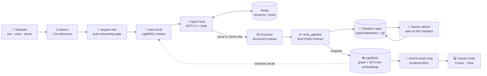
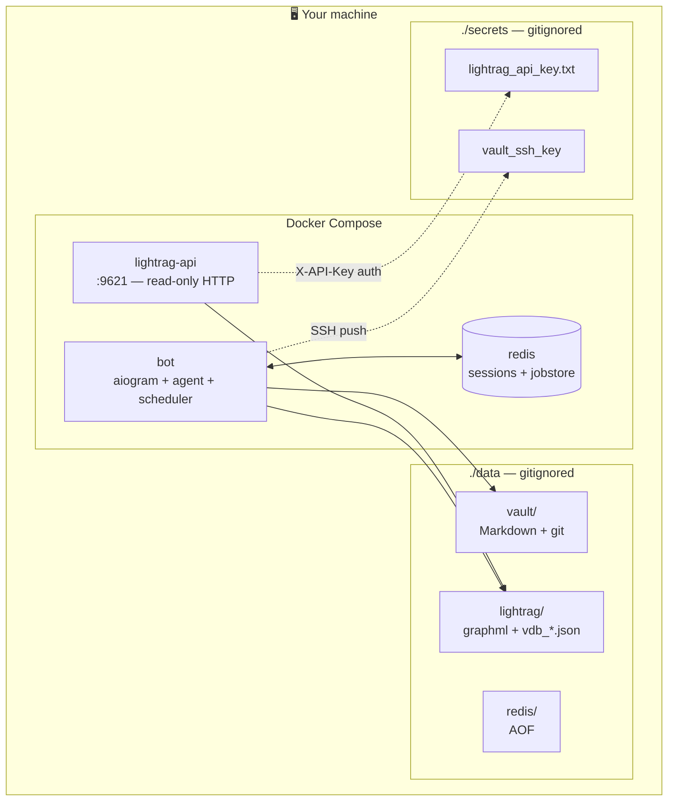

<div align="center">

# 🧠 Mnemo

### Your second brain. In Telegram. On your own infrastructure.

[](https://www.python.org/)
[](https://docs.docker.com/compose/)
[](LICENSE)
[](https://platform.openai.com)
[](https://obsidian.md)
[](https://pypi.org/project/mnemo-brain-mcp/)

**Talk to it. Forget nothing. Code with it.**

</div>

---

## ✨ What is Mnemo?

Mnemo is a **self-hosted AI assistant in Telegram** that turns every conversation into a **structured knowledge graph** — stored as plain Markdown in your own Obsidian vault, indexed in a typed graph database, and exposed as an MCP server so **Claude Code** / **Cursor** / **Cline** can query your second brain while you code.

```
🗣️  You:    "Had a call with Anna from LegAI today.
            We agreed to ship the MVP by June 15.
            She'll handle the architecture."

🤖  Mnemo:  ✓ noted.
            Created: Anna (👤 People), LegAI (🏢 Jobs),
                    Ship MVP (✅ Tasks, due 2026-06-15).
            Linked:  Anna —[works_at]→ LegAI
                    Task —[for_job]→ LegAI
                    Anna —[related_people]← MVP

   …a year later, in Claude Code:
   
🤔  You:    "What did I plan for LegAI before?"
🤖  Claude: "You shipped the MVP with Anna by June 15. She handled
            architecture; you were focused on the API layer."
```

It runs **entirely on your own machine** (Docker), syncs to your own GitHub repo (optional), and never leaks your second brain to anyone. No cloud DB, no analytics, no telemetry.

---

## 🎯 Why Mnemo

### The problem
- 💭 You forget important things you told ChatGPT 3 months ago
- 📝 Note-taking apps don't auto-link or surface the right thing at the right time
- 🤖 AI coding assistants don't know your context (people, projects, decisions)
- 🔒 You don't trust cloud providers with your second brain

### The Mnemo answer
- 💬 You just **talk** in Telegram. Voice, photo, text — Mnemo turns it into structure
- 🕸️ Notes are **typed-linked** automatically: `task —[for_project]→ project —[for_job]→ job —[owner]→ you`
- 🧠 Auto-recall: every message you send pulls relevant context from your past **automatically**
- 🔗 MCP server exposes your brain to Claude Code / Cursor / Cline — they finally know who Anna is and what Mnemo MVP means
- 🏠 100% self-hosted: your vault is your git repo, your graph is on your disk

---

## 🚀 What's inside

<table>
<tr>
<td width="50%" valign="top">

### 🧠 Memory
- **Two-layer memory** (ADR-0001): `90_Transcripts/*.md` is the *literal* immutable log of every session; the typed graph is a derived projection. Read-path priority: **slot → transcript → graph** — the bot never loses the user's actual words to LLM paraphrasing
- **Read-before-ask, hard-enforced.** Every reply that pattern-matches "I don't remember / I don't see / not in memory" without a prior `recall` is auto-retried with a guard prompt forcing `recall` first ([agent/guard.py](src/agent/guard.py))
- **Slot-binding for clarifying questions.** When the bot asks a direct question ("what's the restaurant called?"), the agent registers a `pending_slot`; the user's next reply is recorded *verbatim* before any LLM normalization. The extractor uses these literals as authoritative ([session/slots.py](src/session/slots.py))
- **Proper-noun preservation.** Pydantic `Entity` validator refuses to write a note that dropped a capslock or CamelCase token from the source ("Ресторан БЕК" can't become "ресторан (семейный)")
- **Multi-turn onboarding.** Asks clarifying questions, force-ends if it starts looping (rapidfuzz repetition detector), silently builds your brain skeleton
- **Auto-recall middleware.** Every text message triggers a parallel LightRAG semantic lookup — bot always sees relevant past context. Runs concurrently with session setup so it doesn't gate the LLM call
- **Owner.md auto-refresh.** When you announce a new job / life event / theme, the «who am I» card is regenerated by LLM from current vault state
- **Topic-shift detector**, suppressed while the bot is mid-Q&A (so your answer doesn't land in a new session)

</td>
<td width="50%" valign="top">

### 🔗 Typed graph
- **9 entity types, 8 typed relations.** Every wikilink has meaning
- **Owner-anchored.** All entities except `person` link to `_meta/owner` — your brain has a center
- **Bidirectional inverses.** `person.works_at = job` automatically generates `job.employs = [person]`
- **Custom KG injection.** Your typed wikilinks become graph edges directly — **zero LLM-extraction overhead**, ~$0.0001 per note (embeddings only)
- **READ before WRITE.** Agent must search vault for similar entities before creating new ones — no duplicates ever

</td>
</tr>
<tr>
<td valign="top">

### 🛡️ Quality gates
- **Strict pydantic Entity contract.** `body: str` + `links: list[str]` are gone. Markdown can't sneak into structural fields
- **Owner-anchor enforced.** `model_validator` auto-attaches `owner: [[_meta/owner]]` to every non-person entity — agent physically can't create a job/project/theme without graph-anchoring
- **Vault-language directive.** One language per vault, picked at onboarding, injected into all entity-creating prompts
- **Genre rules per type.** `memory` ≠ biography; goals → `thought` (not `theme`); single-word common themes blocked
- **Two-gate dedup.** rapidfuzz string-match catches typos; LightRAG embedding-search catches synonyms (`AI` ↔ `искусственный интеллект`)
- **Path-traversal guard.** All vault paths go through `resolve_inside_vault`
- **Reply fingerprint.** Duplicate sends get suppressed; replies > 4000 chars truncated before send
- **Graceful failures.** Git push fails → vault still committed locally. Tool error → agent gets `tool-error: TYPE` (no API key leak)

</td>
<td valign="top">

### 🔌 Integrations
- **MCP server** at `127.0.0.1:9621` for Claude Code / Cursor / Cline
- **`mnemo-brain-mcp`** [on PyPI](https://pypi.org/project/mnemo-brain-mcp/) — `pip install mnemo-brain-mcp`, done
- **Vault git-sync** with conflict alerts to Telegram (no auto-resolve)
- **Bidirectional sync.** Edit notes manually in Obsidian → bot picks up via periodic git-pull → graph reindexes

</td>
</tr>
<tr>
<td valign="top">

### 🎙️ Multimodal & UX
- **Text · Voice · Photo.** Whisper-1 transcription, GPT-5.4 Vision OCR
- **Coalesced input.** Type 3 messages in 2 seconds — bot reads them as one
- **Streaming UI.** Replies appear as they're being written; tool calls swap the placeholder to «💭 проверяю память…» / «✍️ запоминаю…» so you see what the bot is doing in real time
- **3 UI languages × 3 vault languages** (ru / en / uz, independently). `/lang` switches both; the bot's stored personality auto-translates to the new language
- **Custom personality.** Name your assistant + 4 communication styles
- **URL fetch tool.** Drop a portfolio link — bot reads the page

</td>
<td valign="top">

### ⏰ Proactivity & safety
- **APScheduler crons.** Morning digest, weekly reflection, stale project nudges
- **Git-backed vault.** Every change is a commit, `/undo` reverts the last (safe-list refuses to undo `_meta/owner.md` / `_meta/portrait.md`)
- **Single-user whitelist.** All other Telegram users dropped silently in middleware
- **Destructive ops** require inline confirmation via Redis pub/sub
- **`/start` is idempotent.** Won't wipe an onboarded brain — explicit file deletion needed

</td>
</tr>
</table>

---

## 🏗️ Architecture

### Data flow



### Container topology (Docker Compose)



**Stack:** Python 3.12 · uv · aiogram 3 · OpenAI SDK ≥1.57 · Redis 7 · APScheduler 3 · LightRAG (embedded + HTTP) · pydantic v2 · rapidfuzz · ripgrep · structlog · BeautifulSoup4 · Docker Compose

---

## ⚡ Quick Start

### 1️⃣ Prerequisites

| You need | Where to get it |
| --- | --- |
| 🐳 Docker + Docker Compose | [docker.com](https://www.docker.com/) |
| 🤖 A Telegram bot token | message [@BotFather](https://t.me/BotFather) → `/newbot` |
| 🔑 An OpenAI API key | [platform.openai.com/api-keys](https://platform.openai.com/api-keys) |
| 🆔 Your own Telegram user ID | message [@userinfobot](https://t.me/userinfobot) |

### 2️⃣ Bootstrap

```bash
git clone https://github.com/komrxn/Mnemo.git mnemo
cd mnemo
./setup.sh                  # idempotent — creates secrets/, data/, api key
```

### 3️⃣ Fill `.env`

Three values are required, the rest have safe defaults:

```env
TELEGRAM_BOT_TOKEN=123456:AA...your_token...
OPENAI_API_KEY=sk-proj-...
ALLOWED_USER_IDS=123456789
TZ=Europe/London            # your timezone
```

> 📦 Full list with comments lives in [`.env.example`](.env.example).
> Notable: `OPENAI_MODEL_MAIN` (default `gpt-5.4`), `SESSION_IDLE_TIMEOUT_MIN` (15), `VAULT_PULL_INTERVAL_MIN` (2), `SENTRY_DSN`.

### 4️⃣ (Optional) Vault git sync

Skip if you don't care about pushing your vault to GitHub.

```bash
ssh-keygen -t ed25519 -C "mnemo-vault" -f secrets/vault_ssh_key -N ""
chmod 600 secrets/vault_ssh_key
# → add secrets/vault_ssh_key.pub as a Deploy key on a private GitHub repo
#   (Settings → Deploy keys → Add → ☑️ Allow write access)
```

Then in `.env`:
```env
VAULT_GIT_REMOTE=git@github.com:yourname/your-vault.git
```

### 5️⃣ Launch

```bash
docker compose up -d --build
docker compose logs -f bot
```

Wait until you see `Run polling for bot @your_bot id=…` — you're live.

```bash
docker compose ps
# NAME                STATUS                       PORTS
# bot                 Up X minutes (healthy)       —
# lightrag-api        Up X minutes (healthy)       127.0.0.1:9621->9621/tcp
# redis               Up X minutes (healthy)       6379/tcp
```

### 6️⃣ First contact in Telegram

Open your bot in Telegram. **Just say hi** — auto-onboarding kicks in (no need for `/start`):

1. **Pick a name** for your assistant (`Max`, `Mia`, `Mnemo`, …)
2. **Pick a style** — friendly / direct / sarcastic / mentor
3. **Tell the bot your own name**
4. **Pick a vault language** — `Russian` / `English` / `Mixed`. All canonical names, theme names, and entity titles will be created in this language consistently — no `cybersecurity.md` mixed with `образование.md`
5. **Send a free-form portrait** — projects, people, goals, anything. Voice messages work
6. Bot asks a few clarifying questions, then **silently builds your brain skeleton**
7. Final message: «Записал. Закрепил [your name]'s current job, partner, key projects, …»

You can now message it anything. Try:

> _"Сегодня встретился с Максом. Обсудили запуск нового продукта в LegAI к 1 июля."_

…and watch a real graph form note-by-note.

### 7️⃣ Connect Obsidian (optional, recommended)

If you set up vault git sync:

```bash
git clone git@github.com:yourname/your-vault.git ~/MyVault
```

Open `~/MyVault` as an [Obsidian](https://obsidian.md) vault. Install **Obsidian Git** community plugin → set auto-pull every 5 min. Now your vault is a living, browsable graph.

---

## 📁 Vault structure

```
vault/
├── _meta/
│   ├── owner.md                ⭐ you — central anchor of the graph
│   ├── portrait.md             your raw onboarding portrait (archived)
│   ├── scheduled_tasks.md      live cron tasks
│   ├── MOC_People.md           🗺️  Map of Content — all people
│   ├── MOC_Projects.md         🗺️  all projects
│   ├── MOC_Jobs.md             🗺️  all jobs
│   └── MOC_Themes.md           🗺️  all themes
├── 00_Inbox/                   unprocessed captures
├── 10_Daily/                   daily session notes
├── 20_People/                  👤 people in your life
├── 30_Jobs/                    🏢 companies, organizations
├── 40_Projects/                🚀 work & personal projects
├── 50_Tasks/                   ✅ tasks with deadlines
├── 60_Thoughts/                💭 ideas, observations
├── 70_Memories/                🎞️ personal facts, past events
├── 80_Themes/                  🏷️ recurring themes
├── 90_Attachments/             🎧🖼️ voice messages, images
└── 90_Transcripts/             📜 immutable literal log of every session
                                    (YYYY/MM/YYYY-MM-DD_<session_id>.md)
```

> **About `90_Transcripts/`:** every closed session is sealed here as a
> dated, *dialog-verbatim* Markdown file with frontmatter `type: transcript`.
> This layer is the primary source of truth for "what was said"; the graph
> is a lossy projection of it.
> - Wikilinks inside transcripts are *escaped* (`\[\[X\]\]`) so they don't
>   generate Obsidian graph edges — transcripts are document-only.
> - LightRAG indexes transcripts for semantic recall but does **not** add
>   them as KG entities (graph stays entity↔entity).
> - Recommended: exclude `90_Transcripts/` from Obsidian Graph view
>   (Settings → Files & Links → **Excluded files**). See [§Recommended
>   Obsidian Graph view](#-recommended-obsidian-graph-view) below.

### Forward relations (graph edges)

These 8 frontmatter fields become typed edges in the LightRAG graph:

| Field | From → To | Example |
| --- | --- | --- |
| `owner` | any (except person) → `_meta/owner` | "this task is mine" |
| `works_at` | person → job | Anna → LegAI |
| `for_job` | task / project → job | task is for LegAI |
| `for_project` | task / thought / memory → project | task is for Mnemo |
| `themes` | project / thought / memory → theme | Mnemo themed `AI` |
| `about_person` | thought / memory → person | thought about Anna |
| `related_people` | any → person(s) | involves [Anna, Bob] |
| `parent_theme` | theme → theme | "GenAI" → "AI" |

Inverse fields (`employs`, `tasks`, `projects`, `mentions`, …) are auto-generated by `linking.add_typed_link` and rendered in the `## Связи` section for Obsidian readability.

### Example note

```yaml
---
type: project
status: in-development
aliases: ["MVP", "первый запуск"]
owner: "[[_meta/owner]]"
for_job: "[[30_Jobs/legai]]"
themes:
  - "[[80_Themes/ai]]"
related_people:
  - "[[20_People/anna]]"
---

AI-юрист на узбекском праве; делается с Аней на базе LegAI; в продакшене с июня.

## Факты

- Дедлайн MVP: 15 июня 2026
- 3000+ пользователей в beta
- Stack: GPT-5.4 + RAG over uzbek law corpus

## Связи

- **owner**: [[_meta/owner]]
- **for_job**: [[30_Jobs/legai]]
- **themes**: [[80_Themes/ai]]
- **related_people**: [[20_People/anna]]
```

---

## 💬 Bot commands

| Command | What it does |
| --- | --- |
| `/start` | Initiates onboarding (or says "жив" if already onboarded) |
| `/save` | Force-close current session and extract notes immediately |
| `/undo` | Revert the last vault commit (safe-list: refuses to undo onboarding files) |

Sessions also auto-close after `SESSION_IDLE_TIMEOUT_MIN` minutes of inactivity (default 15).

You don't need `/start` to begin — **just send any message**. If you have no profile yet, auto-onboarding kicks in.

---

## 🔌 Connect to Claude Code / Cursor / Cline (MCP)

### Step 1 — Install the MCP bridge

```bash
pip install mnemo-brain-mcp
# or with isolation:
pipx install mnemo-brain-mcp
```

[`mnemo-brain-mcp`](https://pypi.org/project/mnemo-brain-mcp/) is a friendly fork of [`desimpkins/daniel-lightrag-mcp`](https://github.com/desimpkins/daniel-lightrag-mcp) — same protocol logic, renamed for a clean `pip install`.

### Step 2 — Register with Claude Code

```bash
API_KEY=$(cat secrets/lightrag_api_key.txt)
claude mcp add mnemo-brain --scope user \
  -e LIGHTRAG_BASE_URL=http://localhost:9621 \
  -e LIGHTRAG_API_KEY="$API_KEY" \
  -- "$(which mnemo-brain-mcp)"
claude mcp list                 # should show mnemo-brain ✓ Connected
```

Or hand-edit `~/.claude.json`:

```json
{
  "mcpServers": {
    "mnemo-brain": {
      "command": "mnemo-brain-mcp",
      "env": {
        "LIGHTRAG_BASE_URL": "http://localhost:9621",
        "LIGHTRAG_API_KEY": "<paste contents of secrets/lightrag_api_key.txt>"
      }
    }
  }
}
```

### Step 3 — Try it

Restart Claude Code. Ask:

> *"What does my brain know about my current projects?"*

Claude should respond with actual entities from your graph, citing `40_Projects/X.md` paths.

### 🛡️ Security note

`mnemo-brain-mcp` exposes 22 tools — **including write tools** (`insert_text`, `update_entity`, `delete_document`, …). Granting your coding tool access to this server grants it write access to your LightRAG graph.

For Mnemo: the canonical writer to your Obsidian vault is the Telegram bot. Anything an MCP client `insert_text`'s into the graph lives **only in the LightRAG index**, not in your Markdown files. To write to your vault, message the bot.

### Step 4 — Remote access (optional)

Don't expose `9621` to the public internet. Recommended:

- 🛡️ **[Tailscale](https://tailscale.com/)** — `tailscale serve 127.0.0.1:9621` for HTTPS + mesh auth
- 🔒 **SSH tunnel** — `ssh -L 9621:localhost:9621 you@your-server`

---

## 🎨 Recommended Obsidian Graph view

For the cleanest visualization:

- **Filters → search:** `-path:_meta -path:90_Attachments -path:00_Inbox -path:90_Transcripts`
- **Settings → Files & Links → Excluded files:** add `90_Transcripts/` (also hides them from search noise)
- **Display → Existing files only:** ✅ ON
- **Display → Orphans:** ❌ OFF
- **Forces → Repel:** `15`
- **Groups:** color by folder (`20_People` → blue, `40_Projects` → orange, `80_Themes` → green)

The result: your owner sits in the middle, projects radiate outward, themes cluster, tasks orbit their projects.

> Wikilinks inside transcripts are escaped at write time, so even without
> excluding the folder the graph stays clean — the exclusion just removes
> the literal-log files from Obsidian's file tree and search.

---

## 🔧 Configuration

All settings go in `.env`. See [`.env.example`](.env.example) for the full list.

| Variable | Required | Default | What |
| --- | :-: | --- | --- |
| `TELEGRAM_BOT_TOKEN` | ✅ | — | Bot token from @BotFather |
| `OPENAI_API_KEY` | ✅ | — | OpenAI API key |
| `ALLOWED_USER_IDS` | ✅ | — | Comma-separated Telegram user IDs |
| `TZ` |  | `UTC` | Timezone (see [tz database](https://en.wikipedia.org/wiki/List_of_tz_database_time_zones)) |
| `OPENAI_MODEL_MAIN` |  | `gpt-5.4` | Main model (chat, extraction, linking) |
| `OPENAI_MODEL_FAST` |  | `gpt-5.4-mini` | Fast model (topic-shift, owner-refresh) |
| `OPENAI_MODEL_VISION` |  | `gpt-5.4` | Vision model for photo input |
| `OPENAI_EMBED_MODEL` |  | `text-embedding-3-large` | Embedding model (3072 dims) |
| `OPENAI_WHISPER_MODEL` |  | `whisper-1` | Speech-to-text |
| `SESSION_IDLE_TIMEOUT_MIN` |  | `15` | Auto-save session after N min idle |
| `VAULT_PULL_INTERVAL_MIN` |  | `2` | How often to pull manual Obsidian edits (0 = off) |
| `VAULT_GIT_REMOTE` |  | — | SSH URL of your vault repo |
| `SENTRY_DSN` |  | — | Sentry error tracking (optional) |

The `lightrag-api` container also needs `LLM_BINDING`, `EMBEDDING_BINDING`, `EMBEDDING_DIM=3072`, etc. — these are pre-wired in [`docker-compose.yml`](docker-compose.yml) using `${OPENAI_API_KEY}` interpolation.

---

## 🔐 Security & privacy

- 🔒 **Single-user by design.** `ALLOWED_USER_IDS` whitelist enforced in middleware; everyone else silently dropped.
- 🏠 **Your data is yours.** Nothing leaves your Docker host except API calls to OpenAI (and optionally Sentry).
- 📵 **No analytics, no telemetry.**
- 🔑 **API key auth.** `lightrag-api` requires `X-API-Key` for non-whitelisted endpoints.
- 🗝️ **SSH key safety.** Vault deploy key mounted read-only; bot copies to `/tmp` at runtime with `0600`.
- 🛡️ **Git safeguards.** `--force`, `--no-verify`, `--mirror`, `--hard` blocked at code level (assertion).
- 🚧 **Path-traversal protection.** Every vault path normalized + verified to stay inside `VAULT_PATH`.
- ❓ **Destructive actions** require explicit Telegram inline confirmation.
- 🪪 **`/undo` safe-list.** Refuses to revert commits touching `_meta/owner.md` or `_meta/portrait.md`.

---

## 🧪 Verifying everything works

```bash
# 1. Containers healthy
docker compose ps          # all 3 should be (healthy)

# 2. Custom KG injection works (bot logs)
docker compose logs bot | grep "incremental index done (custom kg)"

# 3. HTTP API works
curl -s http://localhost:9621/health

# 4. Auth enforced
curl -i "http://localhost:9621/graphs?label=mnemo"   # → 401 or 403

# 5. Auth lets you in
API_KEY=$(cat secrets/lightrag_api_key.txt)
curl -s -H "X-API-Key: $API_KEY" http://localhost:9621/graph/label/list

# 6. Tests pass
uv run pytest -q tests/    # 178 tests
```

---

## 🛠️ Development

```bash
uv sync                                # install deps
uv run python -m src.main              # run locally (needs Redis on localhost:6379)

uv run ruff check src/ tests/          # lint
uv run ruff format src/ tests/         # format
uv run mypy src/ --strict              # type-check
uv run pytest -q tests/                # 178 tests
```

Pre-commit hooks run `ruff` + `mypy` automatically. **Never use `--no-verify`.**

### Project layout

```
src/
├── agent/           loop (+ streaming + read-before-ask guard), guard,
│                   extractor, linker, owner_refresh, prompts
├── lightrag_svc/    client, indexer, converter, graph_sync, reindex_queue
├── multimodal/      whisper, vision
├── safety/          confirmations
├── scheduler/       apsched, defaults, triggers
├── session/         manager, lifecycle, locks, slots, topic_shift
├── telegram/        bot, formatting (md→HTML),
│                   handlers (text + StreamUI / voice / photo / commands)
├── tools/           registry, obsidian, lightrag, scheduler, misc,
│                   slots (set_pending_slot), recall (4-source memory lookup)
└── vault/           entity (+ proper-noun guard), transcripts,
                    write_pipeline, vault_map, paths, frontmatter,
                    reader, writer, git_ops, linking, dedup, moc, search
```

Each module has **one responsibility** — see [`CLAUDE.md`](CLAUDE.md) for the full coding contract and [`Memory.md`](Memory.md) for the project handoff document.

---

## 📚 Documents

| File | What |
| --- | --- |
| [`CLAUDE.md`](CLAUDE.md) | Coding contract — must-read before changing code |
| [`Memory.md`](Memory.md) | Full project handoff — read this if you're new |
| [`docs/adr/0001-memory-layers.md`](docs/adr/0001-memory-layers.md) | Two-layer memory architecture (transcript + graph), read-path |
| [`IMPLEMENTATION_PLAN_V5.md`](IMPLEMENTATION_PLAN_V5.md) | i18n (ru/en/uz) — UI language + content language separation |

---

## ❓ Troubleshooting

<details>
<summary><b>🔴 Bot doesn't reply / "user not whitelisted"</b></summary>

Your Telegram numeric ID isn't in `ALLOWED_USER_IDS`. Get it from [@userinfobot](https://t.me/userinfobot) — it's an integer like `123456789`, not your `@username`.

</details>

<details>
<summary><b>🔴 First message doesn't start onboarding</b></summary>

Should auto-trigger if vault has no `_meta/portrait.md`. Check `docker compose logs bot` for the line `auto-onboarding triggered`. If your vault has stale files from a previous test, reset:

```bash
docker compose exec -T redis redis-cli FLUSHALL
find data/vault -name "*.md" ! -name ".gitkeep" -delete
rm -rf data/vault/.git
cd data/vault && git init -q -b main && \
  git config user.email "mnemo-bot@localhost" && \
  git config user.name "mnemo-bot" && \
  git add -A && git commit -q -m "init"
docker compose restart bot
```

</details>

<details>
<summary><b>🔴 Graph empty after restart</b></summary>

LightRAG cache is in-memory; after `docker compose restart` it re-reads `data/lightrag/*.json`. If those are missing or stale, run a catch-up reindex:

```bash
docker compose exec -T bot /app/.venv/bin/python -c "
import asyncio
from pathlib import Path
async def main():
    from src.lightrag_svc.indexer import index_files
    vault = Path('/data/vault')
    paths = [str(p.relative_to(vault)) for p in vault.rglob('*.md')
             if not str(p.relative_to(vault)).startswith(('_meta/MOC_', '_meta/ontology', '_meta/portrait'))]
    await index_files(paths)
asyncio.run(main())
"
docker compose restart lightrag-api
```

</details>

<details>
<summary><b>🔴 Port 9621 already in use</b></summary>

Another process holds it. Find and kill: `lsof -i :9621` → `kill <PID>`. Common culprit: a previous standalone `lightrag-server`.

</details>

<details>
<summary><b>🔴 MCP query in Claude Code returns 401</b></summary>

`LIGHTRAG_API_KEY` env var in your MCP config is missing or stale. Get the current value:

```bash
cat secrets/lightrag_api_key.txt
```

Re-add via `claude mcp remove mnemo-brain && claude mcp add ...` (see [Step 2](#step-2--register-with-claude-code) above).

</details>

<details>
<summary><b>🔴 <code>lightrag-api</code> crashes with "Embedding dim mismatch"</b></summary>

You're running with old graph data. Either delete stale graph: `rm -rf data/lightrag/* && docker compose restart lightrag-api`, OR ensure `EMBEDDING_DIM=3072` is set (it is, by default).

</details>

<details>
<summary><b>🔴 Bot logs <code>vault_pull_sync</code> conflict</b></summary>

You have manual Obsidian edits AND bot edits that diverged. Bot **does not** auto-resolve — you'll get a Telegram alert. Fix manually in your local clone:

```bash
cd ~/MyVault              # or wherever your local clone lives
git pull --rebase         # resolve conflicts
git push
```

Bot will resume sync on next tick.

</details>

---

## 🤝 Contributing

PRs welcome. Read [`CLAUDE.md`](CLAUDE.md) and [`Memory.md`](Memory.md) **before** writing code — they are the contract.

```bash
# 1. Fork, branch off main
git checkout -b feat/my-thing

# 2. Implement, following CLAUDE.md
# 3. All green:
uv run ruff check src/ tests/
uv run mypy src/ --strict
uv run pytest -q tests/

# 4. Open a PR with what + why
```

---

## 📜 License

[MIT](LICENSE) — do whatever, just keep the copyright.

---

## 👤 Author

**Komron Khakimov** — built this to stop forgetting things.

[](https://github.com/komrxn)
[](https://t.me/komrxn)
[](https://linkedin.com/in/komrxn)
[](mailto:komronkhakimov17@gmail.com)

<sub>If Mnemo helps you remember something important — drop a ⭐. That's the whole reward loop.</sub>
